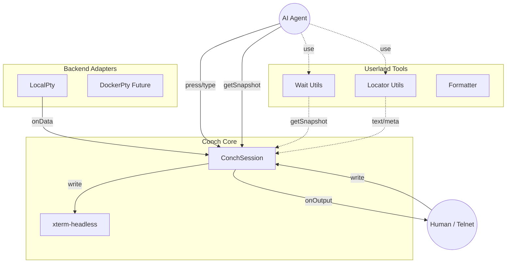

# ソースコード ドキュメント

> ⚠️ これは [src/README.md](./README.md) の日本語訳です。最新情報は英語版をご確認ください。

Conch のコアロジックが格納されているディレクトリです。

## ディレクトリ構造

- **`session.ts`**: `ConchSession` クラス
    - バックエンド（プロセス）とフロントエンド（xterm画面）を繋ぐコントローラーです。
    - "Facts"（事実）としてのスナップショット生成、入力の正規化、リサイズ同期などを担当します。
- **`types.ts`**: 共通型定義
    - `ITerminalBackend` (バックエンドのインターフェース)
    - `ISnapshot` (スナップショットの型定義) など
- **`keymap.ts`**: キーマップ定義
    - `press`, `chord` メソッドで使用されるキー名とANSIエスケープシーケンスのマッピングです。
- **`utils.ts`**: 待機・抽出ユーティリティ
    - `waitForText`, `waitForStable`: 画面状態の変化を待機する関数群。
    - `cropText`, `findText`: スナップショットから情報を抽出する関数群。
- **`backend/`**: バックエンドアダプター
    - PTYの実装（`LocalPty`）が含まれます。
- **`index.ts`**: エントリーポイント
    - ライブラリの公開APIをexportしています。

## アーキテクチャ

Conchは「事実（Facts）」と「解釈（Interpretation）」を分離する設計思想を持っています。
Coreは正確な画面状態の維持に徹し、意味付けはUserland（テストコードやエージェント）に委ねます。

### Coreの責務 (ConchSession)
- **Terminal State**: バックエンドからの出力を正確にxtermバッファに反映し維持します。
- **Facts Provider**: スナップショットを通じて、テキストだけでなくカーソル位置、ビューポート情報などの「事実」を提供します。
- **Input Normalization**: `press('Enter')` などの抽象的な操作を、適切なエスケープシーケンスに変換してバックエンドに送ります。
- **Consistency**: `drain()` により、非同期な書き込み処理とスナップショット取得のタイミング整合性を保証します。

### Userlandの責務 (Utils / User Code)
- **Interpretation**: アプリ固有の意味付け（「ここが選択行である」「エラーが表示された」など）は、CoreではなくUserland側で行います。
- **Formatting**: 行番号の付与や色付けなどの装飾は `formatter` を通じて行います。
