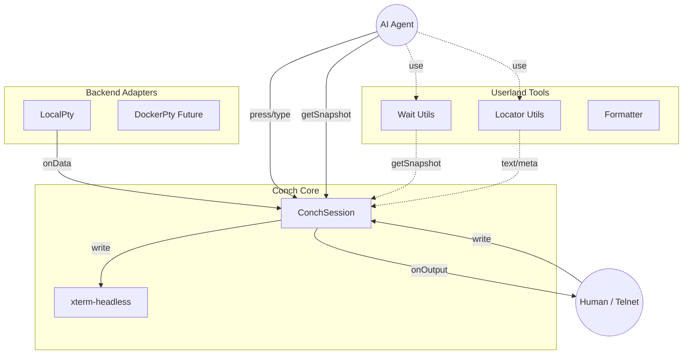

# Source Code Documentation

This directory contains the core logic of Conch.

## Directory Structure

- **`session.ts`**: `ConchSession` Class
    - The controller that bridges the backend (process) and the frontend (xterm screen).
    - Responsible for generating snapshots as "Facts", normalizing input, synchronizing resizes, etc.
- **`types.ts`**: Common Type Definitions
    - `ITerminalBackend` (Interface for backends)
    - `ISnapshot` (Type definition for snapshots), etc.
- **`keymap.ts`**: Keymap Definitions
    - Mappings between key names used in `press` / `chord` methods and ANSI escape sequences.
- **`utils.ts`**: Wait & Locator Utilities
    - `waitForText`, `waitForStable`: Functions to wait for screen state changes.
    - `cropText`, `findText`: Functions to extract information from snapshots.
- **`backend/`**: Backend Adapters
    - Contains implementations of PTY (e.g., `LocalPty`).
- **`index.ts`**: Entry Point
    - Exports the public API of the library.

## Architecture

Conch follows the design philosophy of separating "Facts" from "Interpretation".
Core focuses on maintaining accurate screen state, while leaving semantic interpretation to Userland (test code or agents).

### Core Responsibilities (ConchSession)
- **Terminal State**: accurately reflects and maintains output from the backend in the xterm buffer.
- **Facts Provider**: Provides "facts" such as cursor position and viewport information through snapshots, not just text.
- **Input Normalization**: Converts abstract operations like `press('Enter')` into appropriate escape sequences and sends them to the backend.
- **Consistency**: Guarantees timing consistency between asynchronous write operations and snapshot acquisition via `drain()`.

### Userland Responsibilities (Utils / User Code)
- **Interpretation**: Application-specific semantics (e.g., "this is the selected line", "an error is displayed") are handled in Userland, not Core.
- **Formatting**: Decorations such as adding line numbers or coloring are done through `formatter`.
